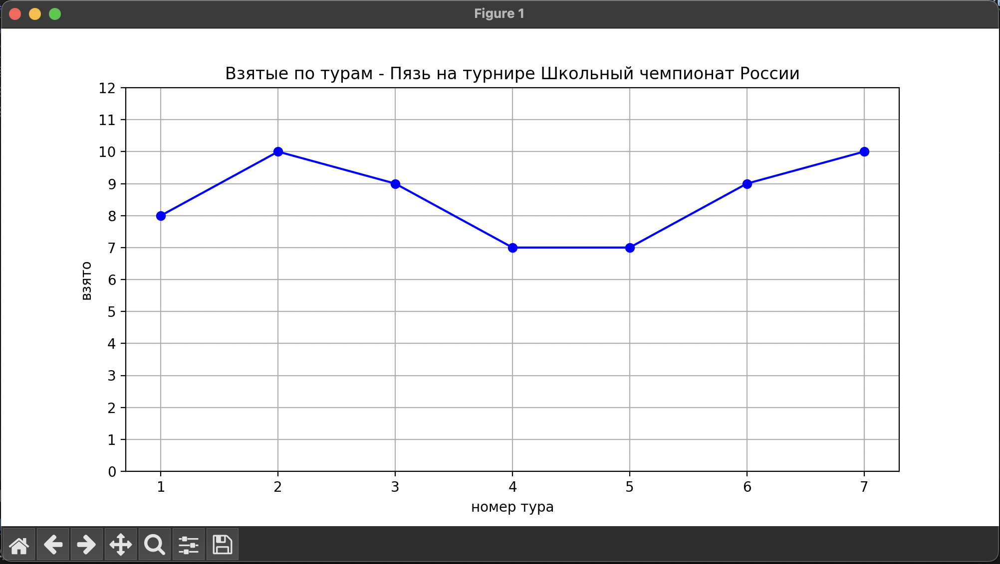

# 📊 Статистика по турам для спортивного ЧГК
>файл сгенерирован ChatGPT

Этот проект предназначен для визуализации статистики по турам для команды в спортивной игре **"Что? Где? Когда?"**, используя данные с официального API [rating.chgk.info](https://rating.chgk.info).

## 🔧 Возможности

- Получение информации о турнире по его ID.
- Извлечение результатов команды по ID турнира и команды.
- Построение графика количества взятых вопросов по турам.

## 🧪 Зависимости

- Python 3.7+
- `requests`
- `matplotlib`
- `numpy`

Установка зависимостей:

```bash
pip install -r requirements.txt
````

## 🚀 Использование

Пример запуска:

```bash
python main.py <ID_ТУРНИРА> <ID_КОМАНДЫ>
```

### Аргументы:

* `--tournament_id` — ID турнира (доступен в URL на [chgk.info](https://chgk.info)).
* `--team_id` — ID команды (также доступен на сайте).

## 📈 Пример графика

Ниже показан пример графика, который строит скрипт:



### 📋 Описание формата графика:

* **Ось X** — номер тура.
* **Ось Y** — количество взятых вопросов в туре.
* **Заголовок графика** — содержит название команды и турнира.
* Синие точки соединены линией для наглядности прогресса команды.

## 📡 Источник данных

Все данные загружаются через открытое API:
[https://api.rating.chgk.info](https://api.rating.chgk.info)

## 📄 Лицензия

MIT License